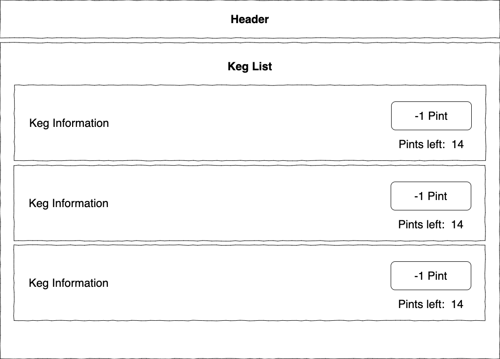

# Double Fountain Brewery w/ Redux

#### By _**John Edmondson**_

### Week 17 Project for the March 2021 Co-hort session: React with Redux

A brief description of what this project does and who it's for

## Tech Stack

**Client:** React, Redux, React-Redux, Javascript, HTML, CSS, Google Fonts, Webpack, Babel, ESlint, Jest

## Run Locally

Clone the project

```bash
  git clone https://github.com/basicjohn/ReactWithRedux-tap-room.git
```

Go to the project directory

```bash
  cd my-project
```

Install dependencies

```bash
  npm install
```

Start the server

```bash
  npm run start
```

## Diagram



## Authors

- [@BasicJohn](https://www.github.com/basicjohn)

## Acknowledgements

## License

[MIT](https://choosealicense.com/licenses/mit/)
